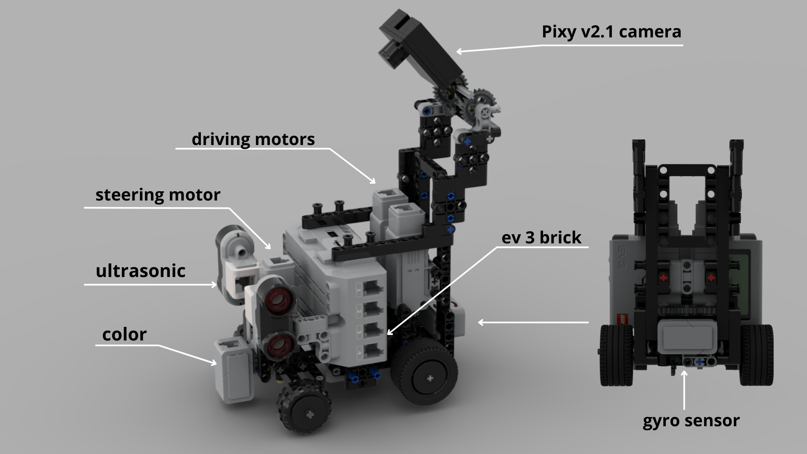
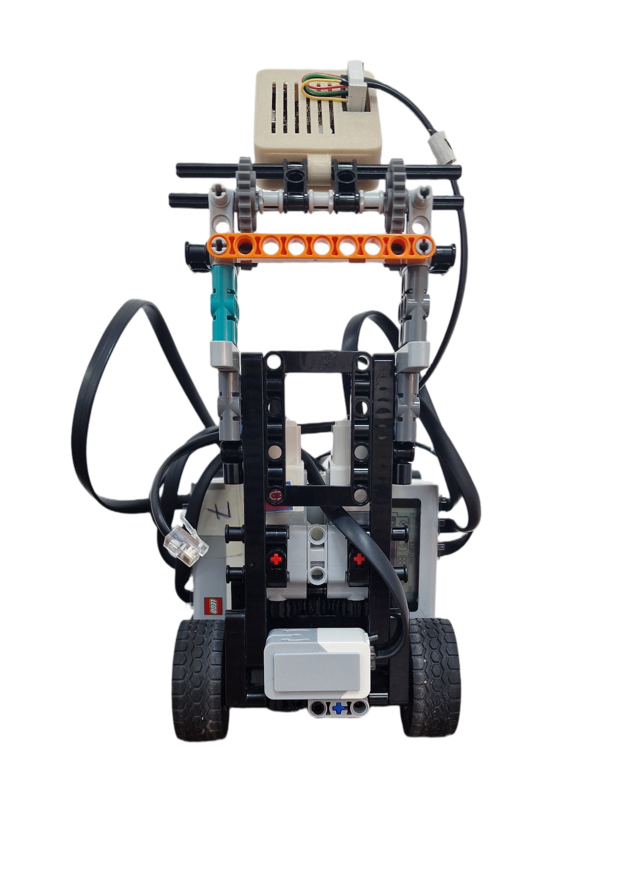
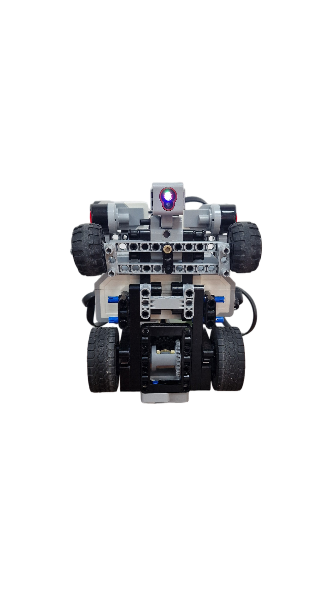
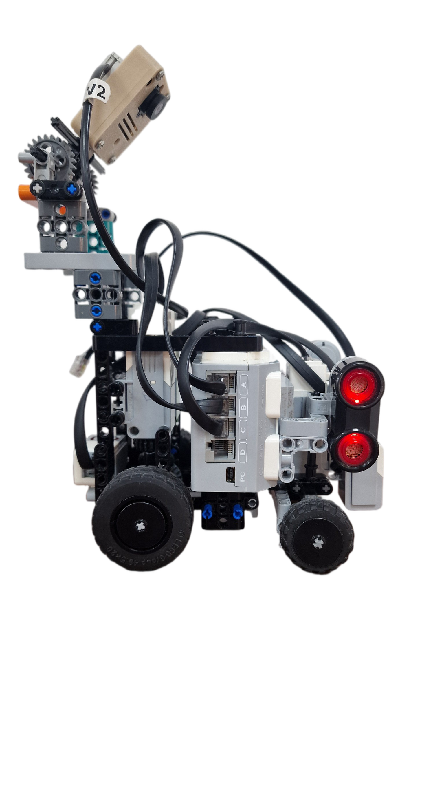

***

**Official repository of the Robotek Lumino team from Kazakhstan. It contains all the engineering materials of our self-driven vehicle's model participating in the WRO Future Engineers competition in the season of 2024.**

***

***

## Contents

* [**Mobility Management**](#mobility-management)
  * [Motor Selection and Implementation](#motor-selection-and-implementation)
  * [Chassis Design and Implementation](#chassis-design-and-implementation)
* [**Power and Sense Management**](#power-and-sense-management)
  * [Sensor Management](#sensor-management)
  * [Power Management](#power-management)
* [**Obstacle Management**](#obstacle-management)
  * [Sensor-Based Obstacle Detection](#Sensor-Based-Obstacle-Detection)
  * [Trajectory Calibration](#trajectory-calibration)
  * [Integration into the Robot's Program](#Integration-into-the-Robot's-Program)
  * [Pseudo Code](#pseudo-code)
* [**Photos**](#photos)
  * [Team Photos](#team-photos)
  * [Vehicle Photos](#vehicle-photos)
* [**Performance Videos**](#performance-videos)

***
## Our vehicle: 

We used components from a EV3 MINDSTORMS Educational kit + a Pixy v2.1   Camera and some other technic pieces from other sets. 

A full list of all the components (not including the camera) can be found here: [Part List](models/robot_partlist.pdf)

Instructions for assembling the robot: [Instructions](models/robot_instruction.pdf)

A 3D model of the robot made in Studio 2.0 can be found here: [3D Model](models/LuminoRobot.io)

The final program/code for our autonomous vehicle can be found here: [Program](src/FE_Lumino.ev3)
***

## Mobility Management

### Motor Selection and Implementation

Motor selection is a crucial component of our vehicle's autonomous navigation system. The Lego MINDSTORMS EV3 set provides two distinct motor options: Large Motors and Medium Motors. In making our selection, we considered key factors such as rotation speed, torque, and encoder accuracy. We also added a large motor from the nxt kit during our motor selection research.

The Large Motor offers substantial power, however, the Medium Motor, while less powerful, is smaller and lighter. This compact size facilitates quicker responses and conserves space within our vehicle design.
Given the constraints of our compact vehicle dimensions (300x200x300mm) and the emphasis on high-speed navigation, we prioritized the Medium Motor for both the steering and driving mechanisms. Our vehicle employs three Medium motors for its movement system: one for steering and two for driving.

### Chassis Design and Implementation

The front steering mechanism uses smaller wheels than the rear and incorporates an approximated Ackermann angle to ensure more precise and stable operation of the odometry and coordinate system. Applying the Ackermann angle allows each front wheel to follow its optimal trajectory during turns, significantly reducing wheel slip and thereby improving the accuracy of odometry measurements. This is crucial for enhancing the precision of the vehicle’s position tracking in space.  

 [Ackerman angle studies](/research/Ackermann_angle_study/README.md)

The rear drive mechanism features large LEGO Technic wheels. Placing the large wheels at the rear serves several practical purposes. Large wheels cover more distance per revolution, leading to higher linear speed, which aligns with our emphasis on speed in the competition. We also use a differential, which plays a key role in improving the vehicle's efficiency and maneuverability. 

The differential allows the rear wheels to rotate at different speeds during turns. This is particularly important because the inner wheel travels a shorter distance than the outer wheel during a turn. Without a differential, both wheels would have to rotate at the same speed, leading to increased friction, tire slip, and reduced handling. The differential addresses this issue by ensuring smooth cornering, reducing tire wear, and improving overall vehicle stability.

***

## Power and Sense Management

### Sensor Management

Our autonomous vehicle employs a combination of sensors to perform precise movements, which is crucial for both obstacle avoidance and qualifying trials in the competition.

Color Sensor: This sensor is used to determine turns and direction by reading colored lines (orange or blue) on the competition field. During the navigation phase, we use the color sensor to reset odometry by detecting two lines and applying mathematical formulas to reset the odometry.
[Color sensor selection](/research/Сolor_sensor_selection/README.md)

Ultrasonic Sensor: Positioned at the front of the vehicle, the ultrasonic sensor measures the distance between the vehicle and field barriers, ensuring that the vehicle's relative position before and after turns is consistently known.

Gyroscope Sensor: The gyroscope sensor plays a key role in maintaining proper alignment. It detects changes in the vehicle's angle of movement, alerting the system to any inaccuracies or deviations. The implementation of a PID (Proportional-Integral-Derivative) controller ensures that any deviation from the desired steering angle is continuously corrected, guaranteeing a straight and accurate trajectory.

The PID controller operates in a continuous cycle throughout the program, ensuring that the vehicle stays on its planned path, maintaining its autonomous navigation capabilities.

Pixy v2.1 Camera: A camera is used to detect and differentiate obstacles during the obstacle round. Custom made 3D Print Models for the [cover](models/pixy_2_cover.stl) and the [case](models/pixy_2_case.stl) for the camera can be found in the corresponding links.

### Power Management
The power for the EV3 Brick and the whole vehicle comes from a rechargeable 10V Lithium Battery. Power management within the EV3 brick consists of multiple switching regulations which are tightly controlled and interlinked in order to boot the electronic circuit correctly.
To protect the EV3 brick from short circuit, 3 poly switches are included, one for each of the two motor drivers and one for the rest of the circuit. Each poly switch has a hold current at approximately 1.1 A and will be triggered at approximately 2.2 A.

### More details about each sensor and its power supply circuit can be found here:

[Color Sensor](/schemes/color-sensor/README.md)

[Gyro Sensor](/schemes/gyro-sensor/README.md)

[Medium Motor](/schemes/medium-motor/README.md)

[Pixy v2](/schemes/pixy2_camera/README.md)

[Ultrasonic Sensor](/schemes/ultrasonic-sensor/README.md)

[EV3 P-Brick](/schemes/programmable-brick/README.md)

[Rechargeable Battery](/schemes/Internal_battery_components/README.md)

***

## Obstacle Management

Effective obstacle management is a critical aspect of our autonomous self-driving robot's navigation system, ensuring it can safely and intelligently navigate through challenging scenarios in the WRO competition. In this section, we elaborate on our obstacle management strategies and the key components involved in this crucial aspect of our robot's functionality.

### Sensor-Based Obstacle Detection

Our robot relies on a Pixy v2.1 Camera to detect obstacles, differentiating between red and green objects with precision. The camera's built-in plugin allows for the recognition of color-based signatures, making it a versatile and efficient tool for identifying obstacles.
To ensure accurate color detection, we employ PixyMon software to calibrate the camera. This calibration process fine-tunes the camera's color recognition capabilities, allowing our robot to precisely distinguish between red and green obstacles on the competition field.

### Trajectory Calibration
Calibrating the robot's trajectory is a vital step in ensuring it safely navigates around obstacles. This process involves placing obstacles in designated locations on the competition field and guiding the robot to drive around them. As the robot maneuvers around obstacles, we record the coordinates of these obstacles in a table for later analysis and fine-tuning.
Once the obstacle coordinates are collected, we import this data into software tools such as Microsoft Excel or Google Sheets. In these programs, we create graphical representations, which often take the form of exponential functions. This function encapsulates the ideal path for the robot to follow when circumventing obstacles.

## Integration into the Robot's Program
### Autonomous Robot Navigation

Our robot's program integrates an optimized obstacle avoidance trajectory. The system employs a regulator to analyze and process trajectory data in real-time. This regulator continuously monitors the robot’s position relative to obstacles and adjusts its path to ensure smooth and efficient navigation. A PID (Proportional-Integral-Derivative) controller is used for precise tuning and enhancing the robot's responsiveness during obstacle avoidance.

## Sensor Integration and Odometry

### Sensor-Based Navigation

1. **Direction Determination:** Upon startup, the robot begins moving and detects the first line. If the line is orange, the robot will proceed clockwise; if the line is blue, it will proceed counterclockwise. The robot then reads the second line, and the difference between the two lines allows the robot to correctly reset its odometry and gyroscopic sensor with each turn.

2. **Reading the Second Line:** After crossing the first line, the robot continues and crosses the second line. By analyzing the difference between the two lines, the system calculates the exact position and adjusts the odometry.

3. **[Odometry](./research/Odometry) and Gyroscope Reset:** After determining the position with the second line, the odometry and gyroscopic sensor are reset. This ensures measurement accuracy and prevents errors from sensor drift.

4. **Coordinate Conversion:** Combining data from encoders, the gyroscope, and relevant formulas, we compute the robot's displacement from its starting position and convert it into x and y coordinates. This converts relative odometry into an absolute coordinate system with the map center as the origin.

### Integration and Real-Time Adjustments

All these steps are integrated into a comprehensive control system, allowing the robot to effectively track its position and adjust its path in real time.

## Photos

### Vehicle Photos

  <table>
    <tr>
      <td></td>
      <td></td>
      <td></td>
    </tr>
    <tr>
      <td></td>
      <td></td>
      <td></td>
    </tr>
  </table>

### Team Photos

***

## Performance Videos

Qualification Round Challenge: https://www.youtube.com/watch?v=jyV4YhzWh4M

Obstacle Round Challenge: https://www.youtube.com/watch?v=LjQPfJy8HMM

***

