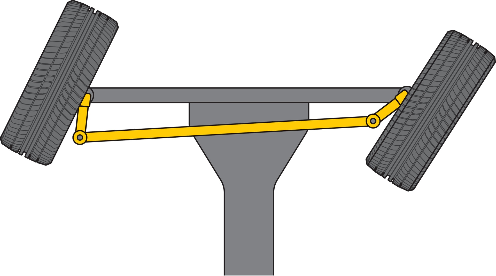
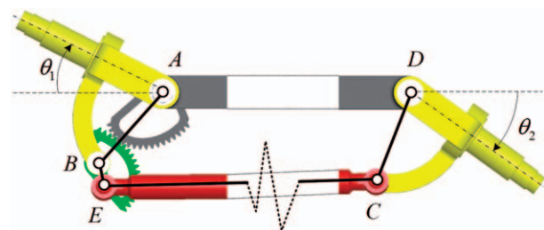
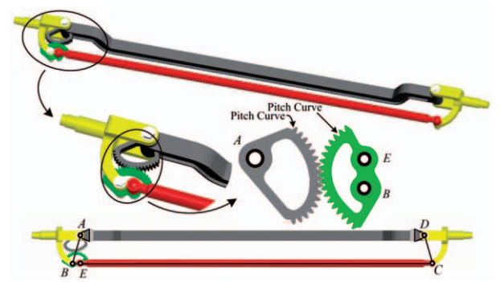

## Steering Mechanism Research

During the development of our robot, we conducted a comprehensive study of various steering mechanisms, with a particular focus on Ackermann steering geometry. This research was a key stage in optimizing our robot's turning characteristics, ensuring both precision and durability in its movements.

In optimizing our robot's maneuverability and response speed, we decided to connect the motor directly to the steering wheel, foregoing the use of linkages. This decision improved maneuverability and enhanced control efficiency.

## Advantages of Direct Motor Connection:

- **Increased Response Speed:** Direct motor connection to the wheel minimizes control delays, providing a quicker and more precise response to commands.
- **Reduced Inertia:** By reducing the number of intermediate elements in the system, the inertia is decreased, allowing the steering wheel to respond faster to changes.
- **Simplified Design:** Eliminating linkages makes the steering mechanism simpler and more compact, reducing the likelihood of mechanical failures and easing maintenance.
- **Increased Reliability:** Fewer moving parts decrease wear and enhance the system's durability.
- **Improved Turning Speed:** Direct motor connection to the wheel allows for faster turns, which is particularly important in competitive scenarios.

This solution has allowed us to achieve higher performance and stability for our robot.

## Understanding Ackermann Steering Geometry

Ackermann steering geometry is a principle that ensures the inner and outer wheels of a vehicle or robot turn at the correct angles relative to each other during a turn. This geometry is crucial as it minimizes wheel slip and wear, enabling smoother and more controlled turns.

In traditional steering systems, especially those using a simple four-bar linkage, maintaining the exact Ackermann angle at different turning radii can be challenging. These systems often fail to achieve ideal wheel angles, particularly during sharp turns, leading to increased friction and wear. Given our robot's compact size and specific design constraints, this issue became significant.

<table>
<tr><th colspan="3" style="text-align: center;">Ackermann Angle Approximation with 4 Axes:</th></tr>
<tr align="center">
<td></td>
<th width="500" height="200">
- Design Simplicity: Using 4 axes is generally simpler to implement and adjust. Fewer components simplify assembly and system setup. 
- Simple Formulas: Formulas for calculating the angle and maneuverability with 4 axes are simpler, making the design and calculations easier. 
- Limited Maneuverability: While 4 axes provide good control, it may not be as precise as a 5-axis system, which can impact the robot's maneuverability and coordinate system.
</th>
</tr>
</table>

<table>
<tr><th colspan="3" style="text-align: center;">Ackermann Angle with 5 (Non-cyclic Gears):</th></tr>
<tr align="center">
<td></td>
<th width="500" height="200">
- Improved Maneuverability: Using 5 axes and non-cyclic gears allows for more precise control of wheel turning angles, which can enhance maneuverability. 
- Potentially Higher Accuracy: Non-cyclic gears can provide smoother and more accurate motion control. 
- Design Complexity: Implementing 5 axes requires a more complex mechanism and time-consuming adjustments, and the formulas and calculations can be more complex.
</th>
</tr>
</table>

## Study of Non-cyclic Gear Mechanism

To overcome the limitations of traditional steering mechanisms, we explored the use of non-cyclic gears. The non-cyclic gear mechanism is designed to maintain the correct Ackermann steering geometry throughout the entire range of turning angles. This approach ensures that our robot’s wheels remain perfectly aligned during both sharp and gentle turns, reducing unnecessary friction and improving overall maneuverability.

 

Unfortunately, due to our robot being built on the LEGO Mindstorms EV3 platform, implementing this solution was nearly impossible. Therefore, we decided to use a traditional solution based on a simple four-bar linkage.

### LEGO Mindstorms EV3 Platform Constraints
- **Component Compatibility:** LEGO Mindstorms EV3 has a limited number of standard parts and mechanisms. The platform is not designed for integrating complex non-cyclic gears needed for precise Ackermann angles.
- **Mechanical Constraints:** The LEGO Mindstorms kit is limited in terms of scalability and precision of motion transfer. Non-cyclic gears require high levels of accuracy and stability, which are difficult to achieve with standard LEGO components.

### Assembly and Adjustment Complexity
- **Technical Difficulties:** Implementing a non-cyclic gear mechanism requires specific knowledge and experience in designing such mechanisms. The complexity of assembly and the need for precise calculations make it difficult to use with the LEGO Mindstorms kit.
- **Precision and Adjustment:** Non-cyclic gear mechanisms require careful tuning to ensure accurate Ackermann steering, which is challenging with LEGO due to limited adjustment capabilities.

## Choice of Traditional Four-bar Linkage Mechanism

Due to the aforementioned constraints, we decided to use a traditional solution based on a simple four-bar linkage. This mechanism was chosen for the following reasons:

### Simplicity of Implementation
- **Available Components:** The four-bar linkage uses standard LEGO parts that are easy to integrate and adjust. This simplifies the assembly and setup of the steering mechanism.
- **Design Simplicity:** The four-bar linkage design is easier to implement and requires fewer computational calculations and technical equipment, making it more suitable for LEGO construction.

### Adequate Functionality
- **Acceptable Accuracy:** Although the four-bar linkage does not provide perfect Ackermann angles, it is sufficiently accurate for most tasks required by our robot. This design allows for acceptable results during turns, minimizing wheel slip and wear.
- **Reliability and Durability:** The simplicity of the design contributes to increased reliability and durability of the mechanism, which is critical for long-term robot operation.

Thus, the use of the four-bar linkage mechanism allowed us to implement a functional and reliable steering system for our robot, despite the limitations of the LEGO Mindstorms EV3 platform.

## Impact on Our Robot’s Design

Implementing Ackermann steering geometry had a significant impact on our robot's performance. The research confirmed that this approach not only improved turn efficiency but also positively affected the coordinate system and odometry, providing more accurate tracking of the robot’s position in space. Additionally, we observed increased wheel lifespan and reduced mechanical stress on other components.

Key benefits observed:
- **Improved Maneuverability:** The robot could perform sharper and more controlled turns without losing speed or stability.
- **Reduced Wear:** The alignment of wheels during turns minimized slip, leading to less wear and longer wheel lifespan.
- **Enhanced Coordinate System Accuracy:** Proper steering geometry allowed for more precise position tracking, crucial for performing complex tasks.
- **Improved Performance in Challenging Conditions:** Whether navigating narrow spaces or making sharp direction changes, the robot maintained high movement precision, critical for its tasks.
- **Reduced Wheel Skidding:** The wheels now skidded less during turns compared to the solution without Ackermann angles.

## Conclusion

Through this detailed research and the application of Ackermann steering geometry, we successfully developed a steering system for our robot that ensures both high performance and durability. Utilizing Ackermann angles to maintain precise steering geometry across various turning scenarios proved to be an invaluable innovation in our robot's design. This research not only guided our design decisions but also highlighted the importance of precise engineering approaches in achieving reliable and effective solutions.
