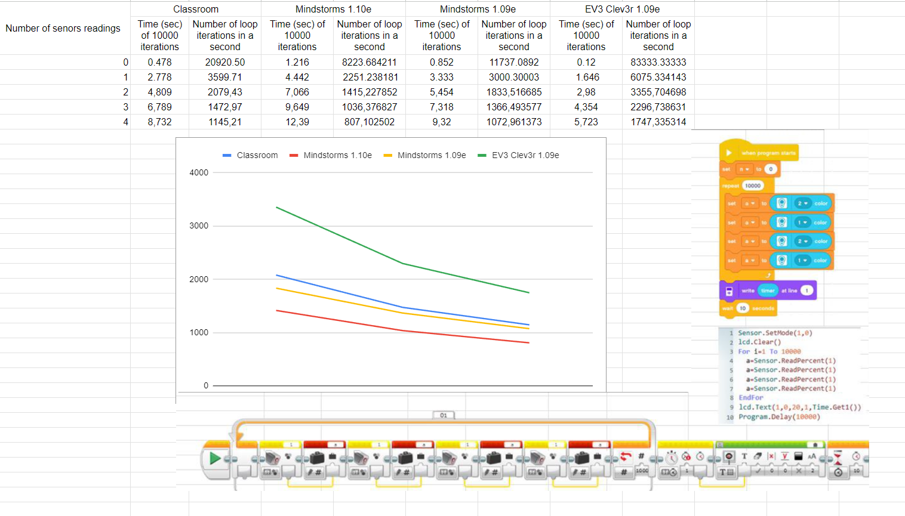

# Platform Performance Analysis

 
The image shows a table, a graph, and several code blocks used to conduct performance tests for various programming platforms with sensor usage.

## Table Description:

The table displays the performance testing results. It includes the following parameters:

- **Number of sensor readings** — the number of times data is read from sensors in each iteration of the loop.
- **Time (sec) for 10,000 iterations** — the time required to complete 10,000 loop iterations with the specified number of sensor readings.
- **Number of loop iterations in a second** — the number of loop iterations that can be performed in one second on each platform with the given number of readings.

The table contains data for the following platforms:

| Number of sensor readings | Classroom: Time (sec) of 10,000 iterations | Classroom: Number of loop iterations in a second | Mindstorms 1.10e: Time (sec) of 10,000 iterations | Mindstorms 1.10e: Number of loop iterations in a second | Mindstorms 1.09e: Time (sec) of 10,000 iterations | Mindstorms 1.09e: Number of loop iterations in a second | EV3 Clev3r 1.09e: Time (sec) of 10,000 iterations | EV3 Clev3r 1.09e: Number of loop iterations in a second |
|---------------------------|--------------------------------------------|--------------------------------------------------|---------------------------------------------------|---------------------------------------------------|---------------------------------------------------|---------------------------------------------------|---------------------------------------------------|----------------------------------------------------|
| 0                         | 0.478                                       | 20920.50                                          | 1.216                                             | 8223.68                                           | 0.852                                             | 11737.09                                          | 0.12                                               | 83333.33                                           |
| 1                         | 2.778                                       | 3599.71                                           | 4.442                                             | 2251.24                                           | 3.333                                             | 3000.30                                           | 1.646                                              | 6075.33                                            |
| 2                         | 4.809                                       | 2079.43                                           | 7.066                                             | 1415.23                                           | 5.454                                             | 1833.52                                           | 2.98                                               | 3355.70                                            |
| 3                         | 6.789                                       | 1472.97                                           | 9.649                                             | 1036.38                                           | 7.318                                             | 1366.49                                           | 4.354                                              | 2296.74                                            |
| 4                         | 8.732                                       | 1145.21                                           | 12.39                                             | 807.10                                            | 9.32                                              | 1072.96                                           | 5.723                                              | 1747.34                                            |

## Platform Performance Comparison:
- **EV3 Clev3r 1.09e** shows the highest performance: even with the maximum number of readings (4), the time to complete 10,000 iterations is only 5.723 seconds, which is significantly faster than the other systems.

- **Mindstorms 1.09e** ranks second in speed, showing relatively fast performance with a small number of readings, but performance decreases significantly as the number of readings increases.

- **Mindstorms 1.10e** demonstrates the lowest performance among the Mindstorms systems, especially with a large number of readings.

- **Classroom** shows the worst results in terms of execution time, although with no or a small number of readings, the number of iterations per second remains relatively high.

## Code Description:

At the bottom of the image, you can see the code blocks used for performance testing. The programs are written both in a graphical editor for EV3 and in a text format.

1. **Graphical Code**:
   - The program performs 10,000 loop iterations, with data being read from several sensors during each iteration. The results are displayed on the robot's screen, and the execution time of the loop is recorded.

2. **Textual Code**:
   - This code performs similar actions but is written in a textual format. It includes sensor setup, execution of a loop with 10,000 iterations, reading data from sensors, and displaying the results on the screen.

## Firmware Version Impact on Performance:

Different Mindstorms firmware versions show significant differences in performance. Version 1.09e operates faster than 1.10e, which may indicate changes in the code or architecture that affected data processing speed.

## Main Conclusion:

The graph and data show that the **EV3 Clev3r 1.09e** platform has the highest performance among all the tested platforms, especially when working with a large number of sensors. We chose this programming language because of its fastest code compilation.
