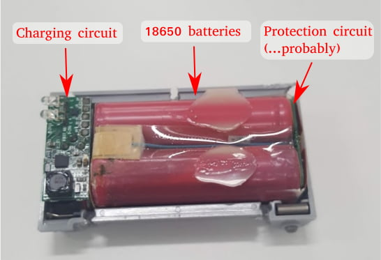
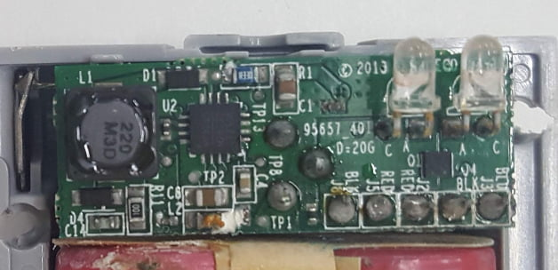
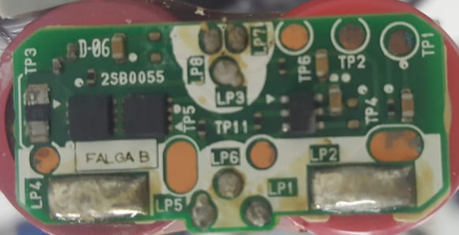

## 
Internal battery components
   
  - #### Inside the plastic case, you will find… 
    - 2 x 18650 Lithium Ion batteries marked “16Wh”.
    - 1 charging circuit. This is where the barrel socket and the LEDs are mounted.
    - 1 protection circuit(?). This is mounted on the 18650 batteries
     
    

    
  - #### Charging Circuit
    The charging circuit is equipped with a Monolithic Power MP26123 battery charging IC. It’s rated for 9 to 24V, so the official Lego charger (10V) is on the lower end of this range. For those thinking of switching to a higher voltage charger; it’s not gonna charge your batteries any faster. The charging IC regulates the voltage and current, so it’ll be around the same regardless of your supply voltage. But it does mean that it’s probably safe to use the much more common 12V power supply to charge the battery.

    Besides the charging IC, there is also a International Rectifier HS8242 power MOSFET. This is probably a replacement for a diode, to prevent the battery voltage from back-flowing to the charger. Nothing else really stands-out.

    

  - #### Protection Circuit
    protection circuit equipped equipped with two Alpha and Omega Semiconductor 7426 N-Channel MOSFET.
    
    

[You can also familiarize yourself with the diagram of the battery, which was made by the Lego](https://github.com/RobotekLumino/Future-Engineers-/blob/main/schemes/rechargaeble-battery.pdf)
     
 
