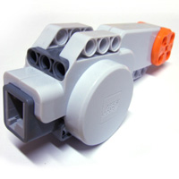
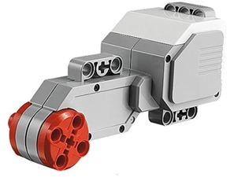
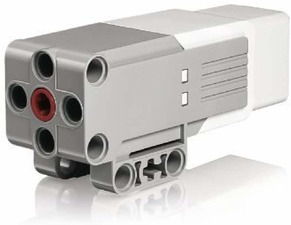

# 
 Motor Selection
 
To compete in the World Robot Olympiad (WRO) in the Future Engineers category, we chose the LEGO Mindstorms EV3 Medium Motor. Let's take a closer look at the design features and benefits of a mid-motor, and explain why it is the optimal choice for this competition.
###  Brief description of motors

<table>
<tr ><th colspan="3">NXT motor</th></tr>
<tr align="center">
<td></td>
<th>This motor is specific to the NXT set (2006). Includes a rotation encoder, returning to the NXT the position of the shaft with 1° resolution. Because of the special connector of this motor (non-standard phone plug type), a cable adapter is required to drive this motor with regular 9V sources. Not recommended for use with a RCX which can't deliver the high current that this motor can consume. Slow rotation speed, minimizing the need of external gear train.</th>
</tr>
</table>
<table>
<tr ><th colspan="3">EV3 Large motor</th></tr>
<tr align="center">
<td></td>
<th>This motor is very similar to NXT motor, but with slightly better fixing capability (compatible with Technic frames, holes aligned with hub). Its efficiency seems slightly lower.</th>
</tr>
</table>
<table>
<tr ><th colspan="3">EV3 Medium motor</th></tr>
<tr align="center">
<td></td>
<th>This motor is one of the highlights of EV3 set compared to NXT one: a motor of reduced size and classical front axle hub. Reduced size comes with reduced power, similar to PF medium motor (but being more down-geared, it is slower and delivers more torque).</th>
</tr>
</table>

### Comparison of motors

<table>
<tr ><th colspan="5">DC Motor Comparison</th></tr>
<tr align="center">
<th rowspan="2" >Model</th>
<th >NXT</th>
<th >EV3 Large</th>
<th >EV3 Medium</th>
</tr>
<tr align="center">
<td ></td>
<td ></td>
<td ></td>
</tr>
<tr align="center">
<td >Weight</td>
<td >80g</td>
<td >82g</td>
<td >39g</td>
</tr>
<tr align="center">
<td >Speed</td>
<td >170 rpm</td>
<td >175rpm</td>
<td >260 rpm</td>
</tr>
<tr align="center">
<td >No-load current</td>
<td >60 mA</td>
<td >60mA</td>
<td >80 mA</td>
</tr>
<tr align="center">
<td >Stalled torque</td>
<td >50 N.cm</td>
<td >43 N.cm</td>
<td >15 N.cm</td>
</tr>
<tr align="center">
<td >Stalled current</td>
<td >2 A</td>
<td >1.8 A</td>
<td >780 mA</td>
</tr>
</table>

  

###  Benefits of a mid-motor for WRO competition
Compact and lightweight:

<ol>The medium motor is significantly smaller and lighter than the large motor, allowing for more compact designs. In competition conditions, this provides an advantage in maneuverability and flexibility in robot design.</ol>
Fast response and high speed:

<ol>Thanks to its high rotation speed, the medium motor provides quick response to commands. This is critical for tasks that require moving quickly or performing actions with high speed and accuracy.</ol>

flexibility in design:
 
<ol>The smaller size of the middle motor allows it to be placed more freely in the robot design without taking up much space. This is especially important when creating complex mechanisms with limited space.</ol>

Efficient use of space:

<ol>The compact size of the middle motor allows optimal use of the robot's internal space to accommodate other necessary components, such as sensors and other actuators. </ol>

Energy consumption:

<ol>A medium motor consumes less energy compared to a large motor. This allows you to increase the robot's operating time without the need for frequent recharging, which is especially important in long-term competitions.</ol>

Balance between power and functionality:

<ol>The mid-mount motor provides enough power to handle most competition tasks while remaining compact and lightweight. This makes it the optimal choice for providing a balance between strength and speed.</ol>

### Conclusion
Using the LEGO Mindstorms EV3 Medium Motor in the World Robot Olympiad Future Engineers competition offers many benefits, including compactness, high speed, precision control and low power consumption. These characteristics make a medium motor an ideal choice for creating agile and efficient robots that can successfully perform complex tasks, which is key to achieving high results in competitions.
