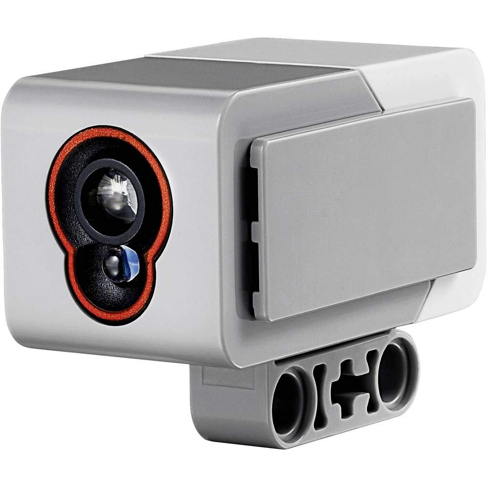

  
  
EV3 Color Sensor (Serial Number: 45506-1)

## Color Sensor in LEGO Mindstorms EV3

The color sensor in LEGO Mindstorms EV3 is used to detect and differentiate colors as well as measure light intensity. Here’s how it works:

### Operating Principle

1. **Light Emission**: The sensor uses an array of light-emitting diodes (LEDs) to illuminate the surface of the object or area being measured. This illumination provides the light needed to identify the color.

2. **Reflection**: When light hits the surface of an object, some of it is reflected back towards the sensor. The amount and characteristics of this reflected light vary depending on the color and material of the object.

3. **Detection**: The sensor contains photodiodes that detect the reflected light. The light is then filtered through colored filters (red, green, and blue) to measure the intensity of light in different wavelengths.

4. **Color Analysis**: By analyzing the intensity of light in different color channels (red, green, blue), the sensor determines the color of the object. It uses this information to match the color to a predefined set of colors.

5. **Light Intensity Measurement**: In addition to color detection, the sensor can measure the intensity of ambient light. This is useful for determining how bright or dim the environment is.

### Technical Details

- **Color Detection Range**: The sensor can distinguish between a wide range of colors and shades. It is designed to detect both standard colors and various shades of those colors.
- **Light Intensity Measurement**: The sensor provides readings for ambient light intensity, which can be used in various applications, such as line following and light-based navigation.

### Programming Uses

In LEGO Mindstorms EV3 software or programming libraries like EV3DEV, you can use the color sensor for various tasks, such as:

- **Color Detection**: Programming the robot to recognize and react to specific colors.
- **Line Following**: Using the sensor to follow lines on the ground based on color contrasts.
- **Ambient Light Measurement**: Adjusting robot behavior based on the lighting conditions of the environment.
- **Sorting and Classification**: Sorting objects based on their color or brightness.

## How we use color sensor

The color sensor is used to determine the direction of movement of the circle and reset the odometry. It determines the orange and blue colors of the lines: if the first color that the robot saw is orange, then it will move clockwise, and if it is blue, then it will move counterclockwise. To do this, we used the RGB mode of the color sensor, if the blue reading is less than 25, then there is a line, then if the red reading is more than 50, then the line is orange, and if it is less, then it is blue.  
You can read about the logic of resetting odometry using a line <a href="-">here</a> 

[Color sensor selection](/research/Сolor_sensor_selection/README.md)
[electroscheme](/schemes/Electric_scheme/color-sensor.pdf)  
[manual guide](https://ev3-help-online.api.education.lego.com/Education/en-us/page.html?Path=blocks%2FLEGO%2FColorSensor.html)
