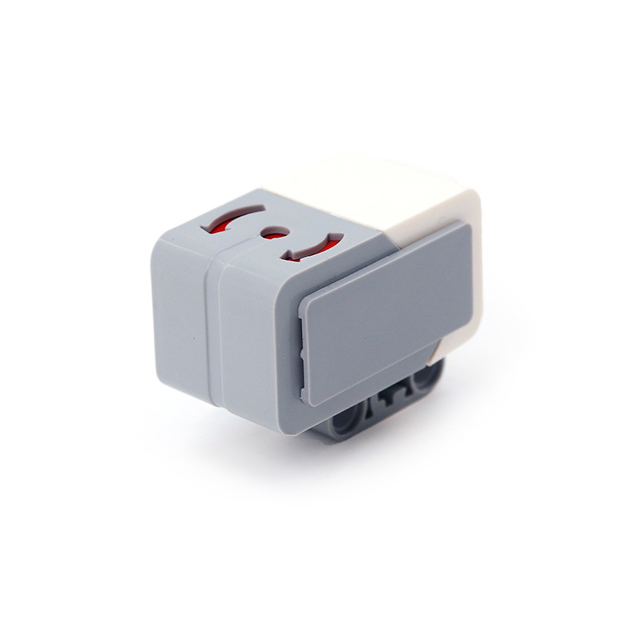

  
  
EV3 Gyro Sensor (Serial Number: 45505-1)

## Gyro Sensor in LEGO Mindstorms EV3

The gyro sensor in LEGO Mindstorms EV3 measures rotational movement and angular velocity, allowing the robot to track its orientation and changes in direction. Here’s how it works:

### Operating Principle

1. **Detection of Rotation**: The gyro sensor detects changes in orientation by measuring rotational motion around its three axes (X, Y, and Z). It senses angular velocity, which is the rate at which the robot rotates about these axes.

2. **Angular Velocity Measurement**: The sensor uses a technology called a **gyroscope** (typically a MEMS gyroscope in modern sensors) to measure the rate of rotation. This is achieved by detecting the Coriolis force generated by the movement of the sensor's internal structure.

3. **Integration of Data**: The sensor provides data on the angular velocity, which is then integrated over time to calculate the angle of rotation. This means the sensor tracks how much the robot has rotated since the last measurement.

4. **Orientation Tracking**: By combining data from the different axes, the sensor helps determine the robot's orientation in space. This is useful for maintaining a specific heading or for performing complex maneuvers.

5. **Drift Compensation**: Gyro sensors may experience drift over time, causing small errors in angle measurement. The EV3 system uses algorithms to correct for this drift and provide more accurate measurements.

### Technical Details

- **Measurement Range**: The sensor can measure rotational speeds in degrees per second, typically with a range that covers the expected rotation rates of the robot.
- **Resolution and Accuracy**: The sensor offers high resolution and accuracy, making it suitable for precise control and navigation tasks.

### Programming Uses

In LEGO Mindstorms EV3 software or programming libraries like EV3DEV, you can use the gyro sensor for various tasks, such as:

- **Orientation Control**: Programming the robot to maintain or adjust its heading based on rotational data.
- **Rotation Tracking**: Keeping track of how far the robot has turned, useful for turning maneuvers and path correction.
- **Stabilization**: Using the sensor to stabilize the robot during movement, preventing it from tipping over or losing balance.
- **Navigation**: Implementing advanced navigation algorithms that rely on accurate rotation and heading information.

## How we use gyro sensor

We use gyro sensor to save robot's initial(starting) position and count its deviation in degrees. In programm we use gyro sensor for tracing the robot position, and control the drive of the robot like turns and correction of the straight ride by PD and PID regulators. Especially it place specific role in steering control that is performed by PID regulator. The PD regulator traces robot's position in angles in comparison with robot's initial (starting) position.
Gyro sensor have a significant role in odometry, especially in math constructions when the angles are needed. Detailed information is in the odometry section.

[electroscheme](/schemes/Electric_scheme/gyro-sensor.pdf)  
[manual guide](https://ev3-help-online.api.education.lego.com/Education/en-us/page.html?Path=blocks%2FLEGO%2FGyro.html)