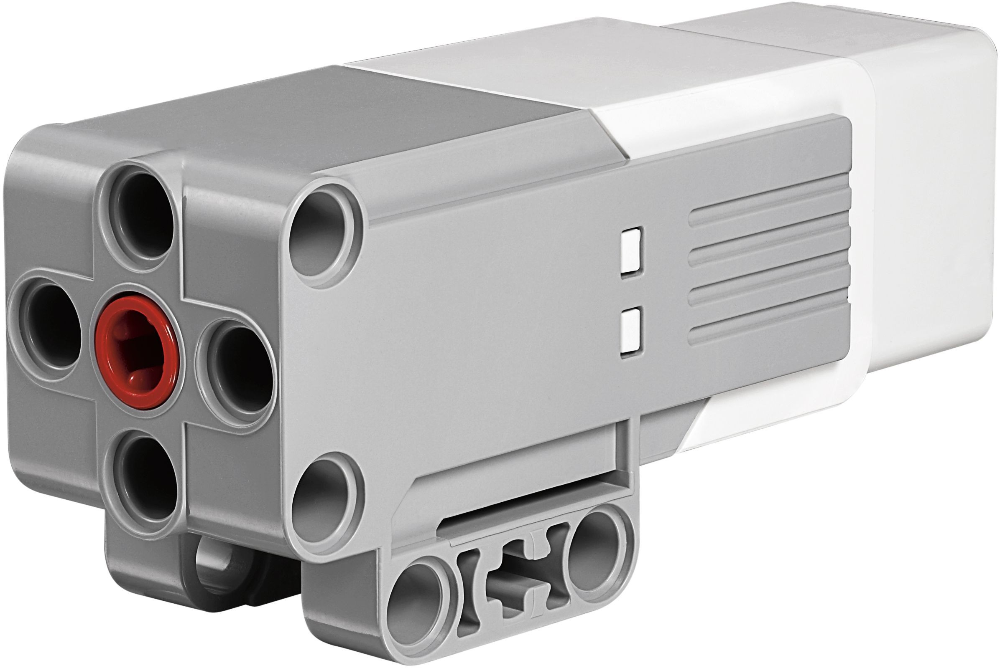

  
  
EV3 Medium motor (Serial Number: 45503-1)

# Medium motor in LEGO Mindstorms EV3

## Key Features of the Medium Motor

- **High Speed**: Up to 240 RPM, making it suitable for tasks that require fast response.
- **Accuracy**: The built-in rotary encoder provides a resolution of 1 degree, allowing precise control of the motor position.
- **Compact**: The motor’s small size (3 x 3 x 7 modules) allows it to be used in confined spaces.

## Encoders in LEGO Mindstorms EV3 Motors

### What is an encoder?

An encoder is a device that monitors and records the position or movement of a rotating element. In LEGO Mindstorms EV3 Motors, encoders are used to determine the number of revolutions of the motor shaft and its current position.

### How an encoder works

The encoders in LEGO EV3 Motors work based on an optical method. They use disks with alternating black and white sections and optical sensors to count the number of sections passing by. Each time a section passes a sensor, it is registered as a pulse.

- **Resolution**: The encoders in the EV3 Medium Motors provide a resolution of up to 1 degree, allowing precise tracking of the rotation angle.
- **Pulse Rate**: The encoders generate pulses that can be used to calculate the speed and direction of the motor.

### Using Encoders in Your Project

Your project used encoders for the following purposes:

- **Motor Position and Speed ​​Monitoring**: The encoders allowed the robot to accurately track the number of revolutions of each motor, which is critical for monitoring the speed and position of the wheels. This allowed the robot to accurately follow a given path and adjust its speed based on changes in load.

## Using Three Motors in the Project

There were three EV3 Medium Motors used in the project, each playing a key role in controlling the robot's movement:

### 1. Front Axle (Steering)

- **Motor Role**: One motor was used to control the front axle, responsible for steering the robot.
- **Precision**: The built-in encoder allowed for precise control of the steering angle of the front wheels, allowing for precise maneuvering.

### 2. Rear Motors and Differential

- **Motor Role**: The other two motors were connected to the rear wheels via a differential. These motors provided the drive for the robot, keeping the rear wheels moving in sync.
- **Differential**: Allowed the wheels to rotate at different speeds, which was especially important when turning, ensuring smooth and stable movement of the robot on various surfaces.
- **Encoders**: Monitored the RPM and speed of each wheel, helping to control the robot's speed and direction.

## Benefits of Using the EV3 Mid Motor with Differential

- **Precise Steering**: The mid motor on the front axle allowed the robot to make precise turns, while the encoder provided feedback to adjust the steering angle.
- **Synchronicity and Flexibility**: The rear motors connected to the differential allowed the robot to efficiently distribute power between the wheels, improving traction and stability when moving on different surfaces.
- **Enhanced Maneuverability**: Using three motors provided high maneuverability for the robot, allowing it to accurately perform complex movements and overcome obstacles.

[Here you can see how we chose the motor for our robot](/research/Motor_selection/README.md)  
[electroscheme](/schemes/Electric_scheme/medium-motor.pdf)  
[manual guide](https://ev3-help-online.api.education.lego.com/Education/en-gb/page.html?Path=blocks%2FLEGO%2FMediumMotor.html)