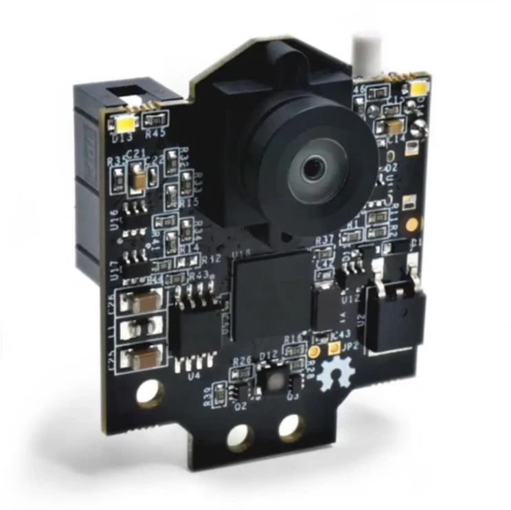
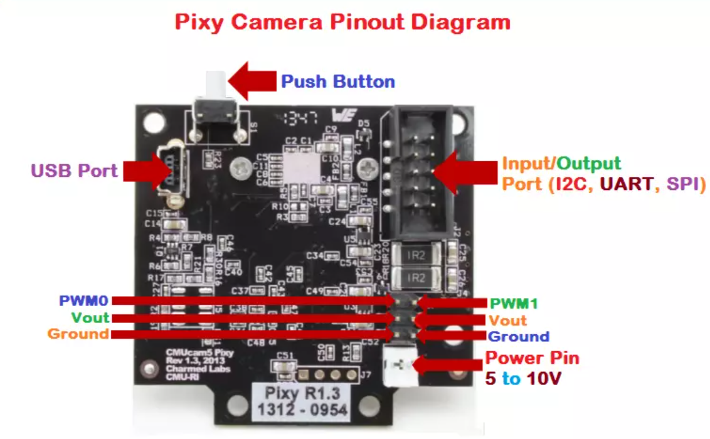

<div align="center">

<p>Pixy V2.1 Camera Sensor</p>
</div>

# Pixy v2.1 for LEGO Mindstorms

**Pixy v2.1** is an object recognition camera that can be integrated with LEGO Mindstorms to enhance the robot's capabilities. The camera is designed to automatically detect and track objects based on color marks or patterns.

## Pixy v2.1 Key Features

- **High Processing Speed**: Pixy v2.1 can process images in real time and detect up to 7 objects simultaneously.
- **Color Recognition**: The camera recognizes objects by color, allowing it to track various color marks.
- **Connectivity**: Pixy v2.1 supports multiple connectivity interfaces including I2C, UART, and digital I/O.
- **Easy Setup**: The camera is easy to setup with the PixyMon software, which allows you to customize color filters and tracking parameters.

## Connecting Pixy v2.1

<div align="center">

<p>Pixy v2.1 Camera Pinout Diagram</p>
</div>

The image above shows the Pixy v2.1 camera pinout diagram:

- **USB Port**: USB port for connecting the camera to your computer for setup and power supply.
- **Push Button**: Push button for manual control and calibration of the camera.
- **Input/Output Port (I2C, UART, SPI)**: Port for connecting the camera to various interfaces such as I2C, UART, and SPI.
- **PWM0 and PWM1**: PWM outputs for controlling servos or other devices.
- **Vout**: Output voltage for powering external devices.
- **Ground**: Ground for connecting the camera to the common circuit.
- **Power Pin (5 to 10V)**: Power the camera from an external source of 5 to 10 V. <br>
[Electroscheme](/schemes/Electric_scheme/pixy2_schematic-2.2.pdf) <br>

## Using Pixy v2.1 with LEGO Mindstorms

Pixy v2.1 can be used for various robotics tasks such as object detection and tracking. In this project, Pixy v2.1 is used to detect two poles, one red and one green.

### Connection

1. **Connecting to LEGO Mindstorms**:
- Connect Pixy v2.1 to the LEGO Mindstorms controller via I2C or UART. This allows data about detected objects to be transmitted to the controller.

2. **Configuring Pixy v2.1 via PixyMon**:
- Download and install the **PixyMon** software from the official Pixy website.
- Connect Pixy v2.1 to your computer using a USB cable.
- Launch PixyMon and follow the on-screen instructions to configure the camera.
- **Calibrating Colors**: In PixyMon, configure the color filters to detect the red and green poles. Use the "Color Code" function to detect and calibrate colors so that the camera can accurately distinguish between red and green colors.
- **Configuring Tracking Parameters**: In PixyMon, you can configure tracking parameters such as the size of objects to detect, sensitivity thresholds, and other parameters.
- **Saving settings**: After setting up the camera, save the settings and close PixyMon. The settings will be saved in Pixy v2.1 and applied when connecting to LEGO Mindstorms.

### Algorithm for working with Pixy v2.1

In the project, Pixy v2.1 is used to detect two poles - red and green. The algorithm for working with the camera is as follows:

- **Red pole**: The camera finds the red pole, determines its position, and the robot goes around it on the right.
- **Green pole**: The camera finds the green pole, determines its position, and the robot goes around it on the left.

### Programming on Clev3r 
To work with the Pixy v2.1 camera via the I2C interface, use the following code: 
```clev3r
Sub I2C
  I2CReady = 1
  While 1=1
    AdvPixy.getLargest(1, pixyX, pixyY, signature)
  EndWhile
EndSub

Function getLargest(in number port, out number x, out number y, out number signature)
  values = Sensor.ReadI2CRegisters(port, 1, 80, 6)
  sig1 = values[0]
  sig2 = values[1]
  signature = (sig1 + sig2 * 256) - 8 * Math.Floor((sig1 + sig2 * 256) / 8)
  x = values[2] - 128
  y = values[3]
EndFunctioneI2CRegister(port, 0, 98, 0)
EndFunction

Function DetourObstacle()
  If @signature = 1 Then
    Speaker.Tone(100, 4000, 50)
    desiredX = 40 * Math.Power(@pixyY, 0.22)
  Else
    Speaker.Tone(100, 500, 50)
    desiredX = -40 * Math.Power(@pixyY, 0.22)
  EndIf
  SteerControl.SetTarget((desiredX - @pixyX) * 0.5)
EndFunctionм

