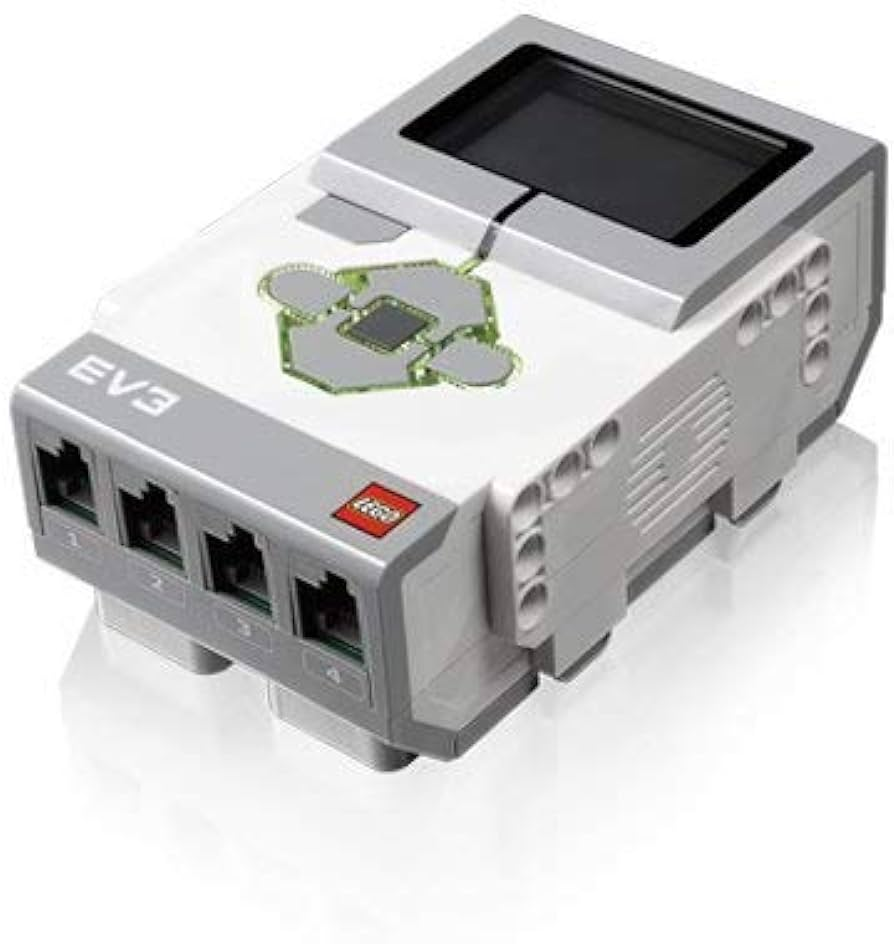
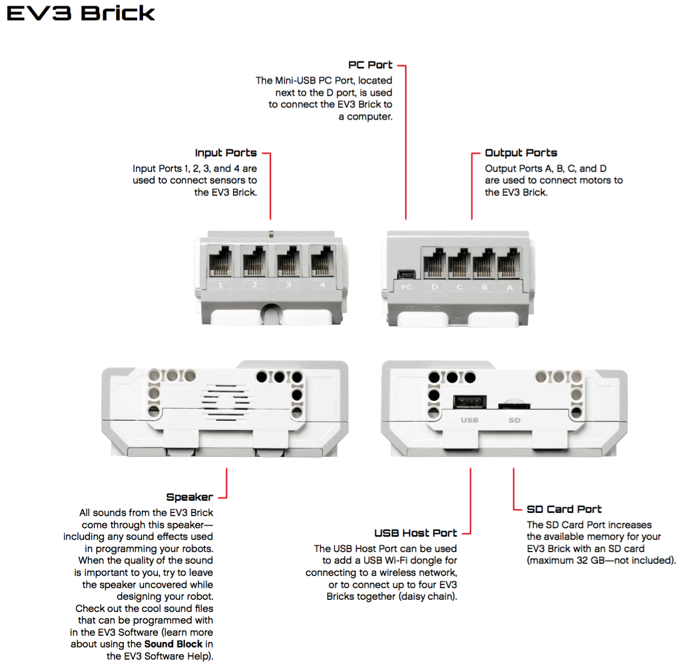

EV3 Intelligent Brick (Serial Number: 45500-1)

# LEGO Mindstorms EV3 Brick

LEGO Mindstorms EV3 Brick is the "brain" of the robot, the main control device to which motors, sensors and other peripherals are connected. It allows you to create and run programs, control robots and exchange data with other devices. EV3 Brick is a programmable microcontroller that gives users the ability to build and program complex robotic systems.

## EV3 Brick Main Specifications

### Processor:
- **Processor**: ARM9 with a clock frequency of 300 MHz.
- **Operating System**: Based on Linux, which allows you to run complex programs and integrate other systems.

### Memory:
- **Built-in Flash Memory**: 16 MB.
- **RAM**: 64 MB.
- **microSD Card Support**: Expandable memory up to 32 GB with a microSD card.

### Screen:
- **Type**: Monochrome LCD with a resolution of 178 x 128 pixels.
- **Functions**: Display text, simple graphics, and menu navigation.
- **Backlight**: Built-in LED backlight for ease of use in low-light conditions.

 

### Connection interfaces:
- **Motor ports**: 4 ports (A, B, C, D) for connecting large and medium motors.
- **Sensor ports**: 4 ports (1, 2, 3, 4) for connecting various sensors (touch, color, ultrasound, gyroscope and infrared sensor).
- **USB port**: Allows you to connect flash drives or exchange data with a computer.
- **Bluetooth**: Bluetooth support for wireless programming and control.
- **Wi-Fi**: Possibility of connection via USB Wi-Fi adapter (not included), which allows you to interact with the robot via Wi-Fi.
- **MicroSD slot**: For expanding memory and loading alternative operating systems.

### Power:
- **Power source**: 2050 mAh lithium-ion battery or six AA batteries.
- **Battery life**: Depends on the intensity of use of motors and sensors, but usually the battery lasts for several hours of active work.

### Sound:
- **Built-in speaker**: Supports playback of sound files in .rso and .wav formats, as well as playback of sound signals during program execution.

### Control buttons:
- **Center button (Enter)**: To select menu items and confirm actions.
- **Navigation buttons (up, down, left, right)**: To move through the menu.
- **Back button (Back)**: To exit the current menu or cancel an action.
- **On/Off Button**: Used to turn the EV3 Brick on and off.

## Programming the EV3 Brick

The EV3 Brick supports programming using various environments:

- **LEGO Mindstorms EV3 Software**: The official graphical programming environment from LEGO that uses blocks to create programs. It is an intuitive tool designed for children and beginners.
- **LEGO Mindstorms Education EV3 Classroom**: A platform designed for educational institutions with advanced features and integration with educational standards.

- **Clev3r for EV3**: The ability to program on the basis of basic plus for more experienced users, which opens up access to more complex algorithms and integration with other systems. Also, the code compilation is several times faster compared to other platforms. [Platform Performance Analysis](/research/comparison_of_performance_of_different_programming_platforms/README.md)
### There are also many other programming tools for this brick.

[electroscheme](/schemes/Electric_scheme/ev3.pdf)  