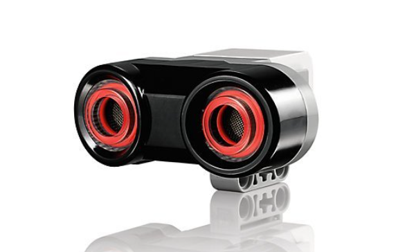

  
  
EV3 Ultrasonic Sensor (Serial Number: 45504-1)

## Ultrasonic Sensor in LEGO Mindstorms EV3

The ultrasonic sensor in LEGO Mindstorms EV3 is used to measure distances to objects using ultrasonic waves. Here’s how it works:

### Operating Principle

1. **Emission of Ultrasonic Waves**: The sensor emits ultrasonic waves at a frequency of about 40 kHz. These waves are invisible and inaudible to the human ear.
2. **Reflection of Waves**: When the ultrasonic waves hit an object, they bounce back to the sensor.
3. **Reception of Reflected Waves**: The sensor captures the reflected waves using a built-in receiver.
4. **Measuring Time**: The sensor measures the time it took for the ultrasonic waves to return. This time is called the time of flight.
5. **Distance Calculation**: Using the speed of sound and the time of flight, the sensor calculates the distance to the object. The speed of sound in air is approximately 343 m/s (depending on temperature and pressure).

### Technical Details

- **Operational Range**: Typically, the EV3 ultrasonic sensor can measure distances from 1 to 255 cm.
- **Accuracy**: The sensor usually has an accuracy within a few centimeters.

### Programming Uses

In LEGO Mindstorms EV3 software or programming libraries like EV3DEV, you can use the ultrasonic sensor for various tasks, such as:

- **Distance Measurement**: Determining the distance to the nearest object or obstacle.
- **Movement Automation**: Programming the robot to stop or change direction based on distance to objects.
- **Data Collection**: Using distance data for analysis and decision-making.

## How we use ultrasonic sensor

Ultrasonic Sensor: An ultrasonic sensor located at the front of the vehicle measures the distance between the vehicle and field barriers, ensuring that the relative position of the vehicle before and after the turn is constantly known.

[electroscheme](/schemes/Electric_scheme/ultrasonic-sensor.pdf)  
[manual guide](https://ev3-help-online.api.education.lego.com/Education/en-us/page.html?Path=blocks%2FLEGO%2FUltrasonicSensor.html)